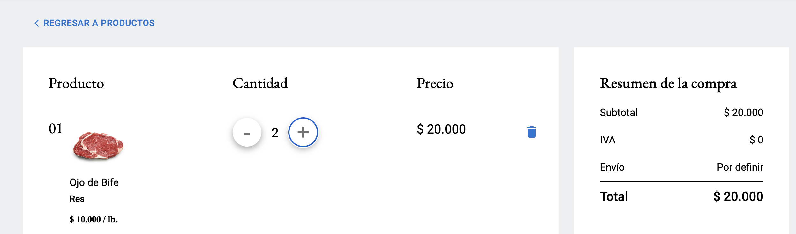

# Al Corte - showcase

[Live Site](https://alcorte.com.co/)

[Source Code](https://github.com/MychelGarzon/meatShop)

## Overview

This Colombian meat shop offers an easy-to-navigate platform where users can browse and filter products on the homepage. Customers can add their desired items to a shopping cart and explore dedicated product pages for detailed information. After placing an order, users will receive a confirmation email for their purchase.

## Key Features

### Browse products

Filter them by meat type

### Product page

### Cart

### Form

## Technologies Used

- **Frontend**: React, Redux
- **Backend**: Serverless
- **Deployment**:
  - frontend: Firebase
  - backend: AWS Lambda, AWS

## Project Architecture

Frontend build with React, email service with AWS Lambda.

## Team

[LinkedIn](https://www.linkedin.com/in/mychel-garzon-trujillo) Mychel Garzon Trujillo - _project management and frontend development_

[LinkedIn]() Juan - _UI/UX Designer_

[LinkedIn](https://www.linkedin.com/in/pinja-alanne-3920a1161) Pinja Alanne - _frontend development_

[LinkedIn](https://www.linkedin.com/in/aj-kivimaki) Atte Kivimäki - _frontend development_

I developed the **shopping cart** and **order form**. I collaborated with the team to set up the Lambda function for email order confirmations.

## Contact

Feel free to [reach out](https://www.linkedin.com/in/aj-kivimaki) for any questions
